# Projet Data Science

## Résumé
Ce projet individuel a été réalisé en 10 jours dans le cadre de ma formation en Data Science à l'[ICAM](https://www.icam.fr/les-campus/strasbourg-europe/) .
L'objectif était la conception d'une application au service de la santé publique, en proposant une idée innovante d’application en lien avec l’alimentation pour l’agence Santé Publique France. À notre disposition, la base de données [Openfoodfacts](https://fr.openfoodfacts.org/).

Nous avons commencé notre étude par une enquête de terrain. C'est la rencontre avec une [diététicienne nutritionniste](https://dietetique.freyder.fr/) qui nous a permis d'identifier les besoins des professionnels: un assistant numérique qui aiderait les patients à mettre en oeuvre le régime alimentaire prescrit par leur nutritionniste. Le module de l'application sur lequel nous avons choisi de nous concentrer est celui qui permettrait de scanner un produit alimentaire et d'être alerté sur le risque de présence d'un allergène, même si celui-ci n'est pas mentionné sur l'étiquette ou si la composition est rédigée en langue étrangère.

Nous avons ensuite exploré la base de données Open Food Facts pour en comprendre la structure, en évaluer la qualité et estimer la faisabilité de notre projet.

Ayant été confronté à un volume de données important, nous avons réalisé un travail de data engineering pour nettoyer et préparer les données. Nous avons également cherché à identifier les technologies les plus adaptées pour la mise en production (MongoDB vs SQL).

Enfin, nous avons réalisé une étude de classification d'allergènes en utilisant différents modèles de machine learning, du plus simple (arbre de décision) au plus complexe (réseau de neurones récurrent LSTM). Les données d'entrées étant textuelles, nous avons utilisé des techniques de NLP pour les traiter (nettoyage, tokenisation, vectorisation).

Si l'arbre de décision s'est révélé être relativement satisfaisant, le LSTM nous a permis d'atteindre des résultats prometteurs: recall de 0.94 sur la classe 0 (absence d'allergène) et accuracy de 0.93. Le LSTM nous a surtout permis de classifier en fonction de la séquence des mots en entrée du modèle: "sans gluten" ou "gluten free" ne signifient pas la même chose !

## Plan du projet
## Plan du projet
1. **Enquête de terrain**
2. **Exploration de la base de données**
3. **Data Engineering : choix d'une structure de données pour la mise en production**
4. **Data Science : Classification d'allergènes**
   4.1. Préparation des données
   4.2. Arbre de décision
   4.3. Perceptron multicouche (MLP classifier)
   4.4. Classification avec réseaux de neurones récurrents LSTM

## Technologies utilisées
- Python
- Pandas
- Matplotlib
- Scikit-learn
- NLTK
- Tensorflow

## 1. Enquête de terrain
Nous avons rencontré une diététicienne nutritionniste pour comprendre les besoins des professionnels de santé. Nous lui avons montré les résultats de notre exploration de la base de données Open Food Facts et lui avons demandé son avis sur l'utilité d'une telle base de données pour les professionnels de santé.
### Pas besoin d'un nouveau Nutri-Score
Selon elle, cette base de données ne devrait pas servir à établir un nouveau système de scoring des aliments, ni même de tenter d'améliorer l'existant. En effet, si le Nutri-Score est facile à comprendre et permet une appréciation rapide du produit, il ne permet pas de construire un régime alimentaire personnalisé. C'est le rôle du professionnel de santé. Seul un professionnel de santé ou un patient très bien informé sont capables de construire un régime alimentaire équilibré. "Un repas équilibré n'est pas une somme de produits A, ni une moyenne supérieure à B", nous a-t-elle expliqué.

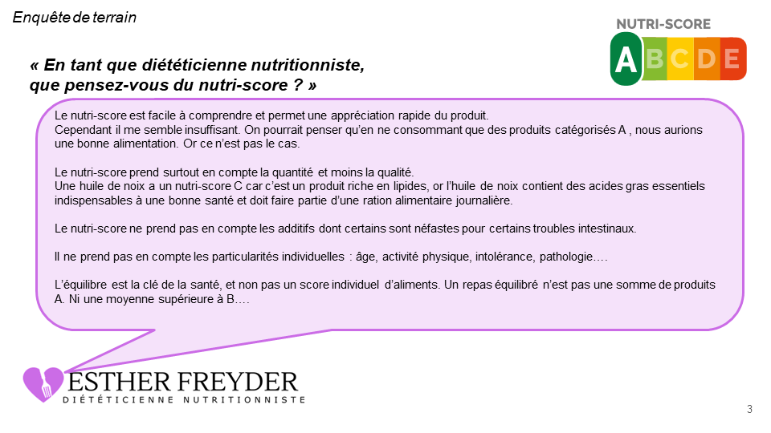

### Un contenu trop général et lacunaire
Lorsqu'on lui demande si l'exploration de la base de données Open Food Facts pourrait être utile pour les professionnels de santé, elle nous répond que les nutritionnistes sont capables d'identifier les données nutritionnelles de base d'un produit en lisant simplement son étiquette. Et malheureusement, les teneurs en micronutriments indispensables sont très rarement renseignées dans la base de données.

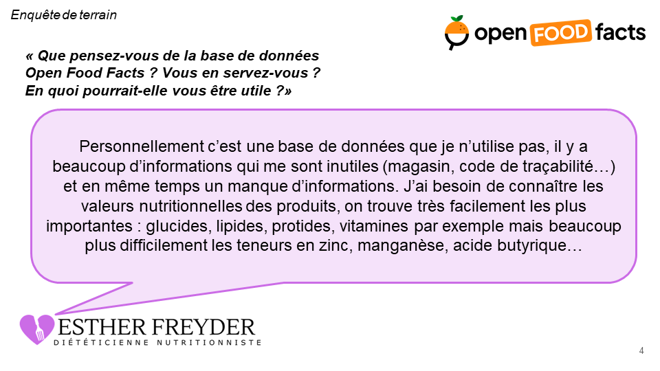

### Un assistant numérique pour les patients
Pourtant, elle nous confie que les patients ont souvent du mal à mettre en application au quotidien les recommandations de leur nutritionniste. Un assistant numérique qui servirait de trait d'union entre le professionnel et le patient serait très utile pour aider ce dernier à mettre en oeuvre le régime alimentaire prescrit.
Selon elle, un tel assistant pourrait avoir deux fonctionnalités principales:
- **Scanner un produit alimentaire et être informé de la manière dont celui-ci peut s'intégrer (ou non) dans le régime alimentaire prescrit**. Dans quel repas de la semaine, en quelle quantité, avec quel autre aliment d'accompagnement, dans quelle recette peut-il être consommé ; comment ajuster le programme alimentaire de la semaine pour l'équilibrer en fonction de ce produit.
- **Scanner un produit alimentaire et être alerté sur le risque de présence d'un allergène**, même si celui-ci n'est pas mentionné sur l'étiquette ou si la composition est rédigée en langue étrangère.

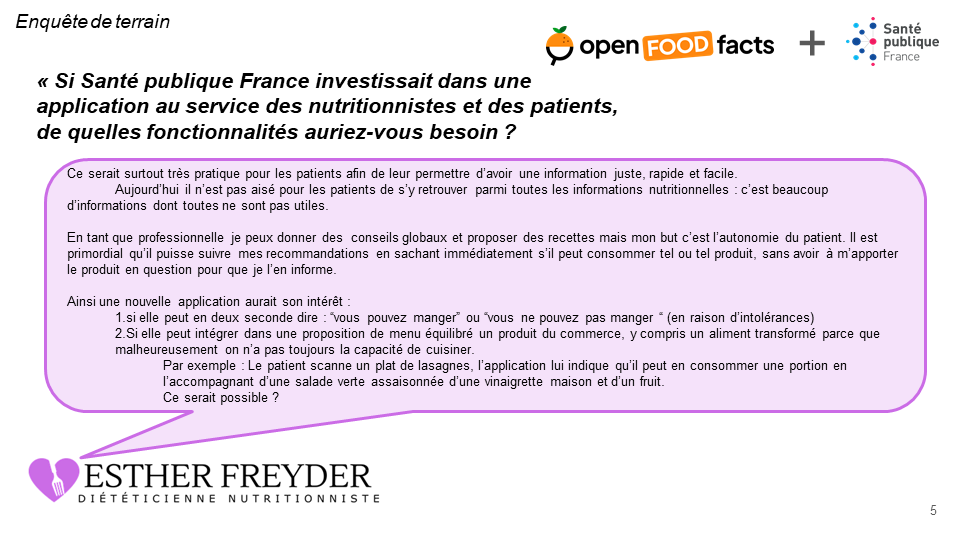

### Traduction des besoins en fonctionnalités
Voici une synthèse des besoins exprimés par la diététicienne nutritionniste:

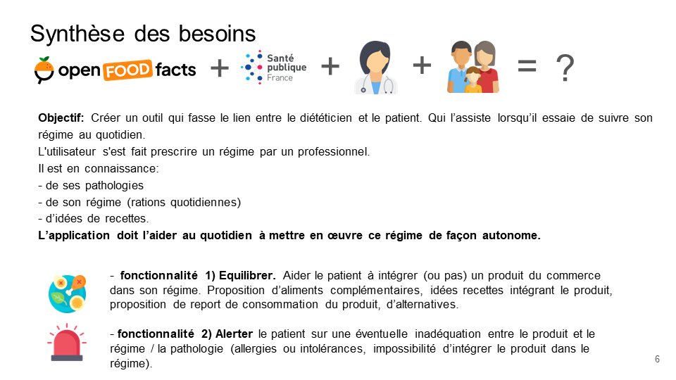

Dans le cadre de notre projet, nous avons choisi de nous concentrer sur la deuxième fonctionnalité: **Scanner un produit alimentaire et être alerté sur le risque de présence d'un allergène**.

## 2. Exploration de la base de données
L'exploration de la base de données Open Food Facts nous a permis d'en comprendre le contenu, la structure et la qualité. Mais surtout de construire avec la diététicienne nutritionniste le projet d'application, et d'en estimer la faisabilité sur la base des données disponibles.

### Le projet Open Food Facts
La base de données Open Food Facts est un projet ouvert et collaboratif initié en 2012. Elle contient des informations sur de nombreux produits alimentaires commercialisés dans le monde entier.

### Contenu de la base de données
Chaque ligne de cette base correspond à un produit alimentaire. Les colonnes contiennent des informations sur la composition du produit, sa provenance, sa marque, son emballage, sa catégorie, ses labels, ses additifs, ses allergènes, ses nutriments, etc. Ces informations peuvent être regroupées en 6 catégories.

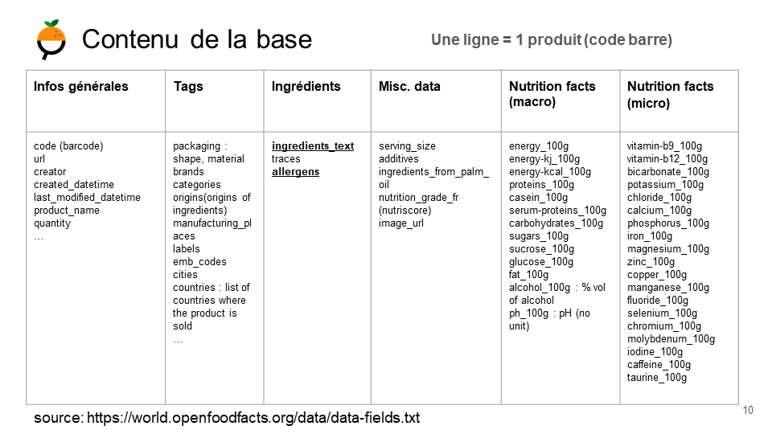

### Contributeurs et évolution de la base de données
L'exploration grâce à la bibliothèque `Pandas` nous renseigne sur l'origine des données: contributeurs individuels via les applications mobiles  (Open Food Facts, Yuka, foodvisor etc.), mais aussi des institutionnels comme le [ministère US de l'agriculture](https://www.usda.gov/) ou l'[EPFL](https://actu.epfl.ch/news/des-donnees-sur-l-alimentation-a-portee-de-clic/).

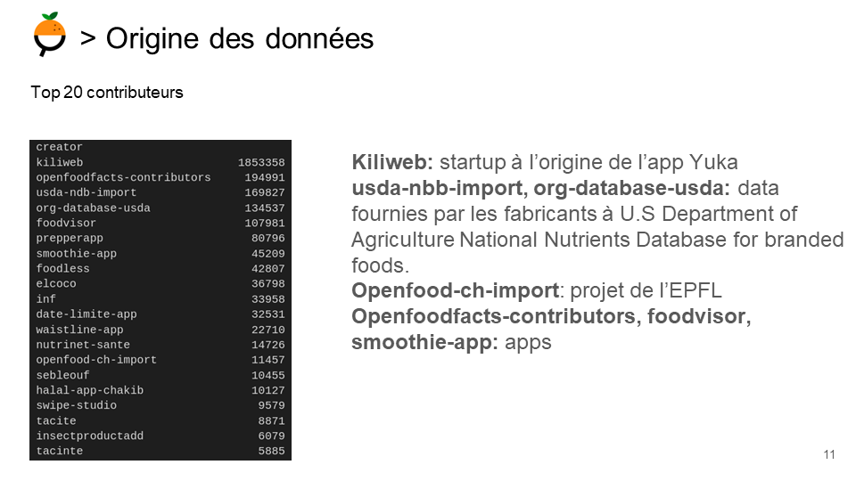

L'affichage du nombre de produits ajoutés chaque mois révèle une croissance constante de la base de données jusqu'en 2022, suivie d'une stagnation puis d'une décroissance depuis 2023. Nous avons également identifié des imports massifs de références à plusieurs reprises, les plus conséquents ayant eu lieu en 2020 et 2017 par l'USDA

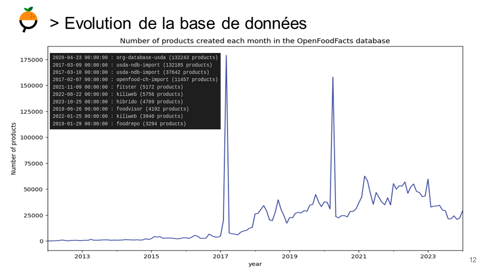

Ci-dessous la courbe cumulative du nombre de produits dans la base. Le ralentissement de la croissance du nombre de produits ajoutés chaque mois est bien visible dès 2023.

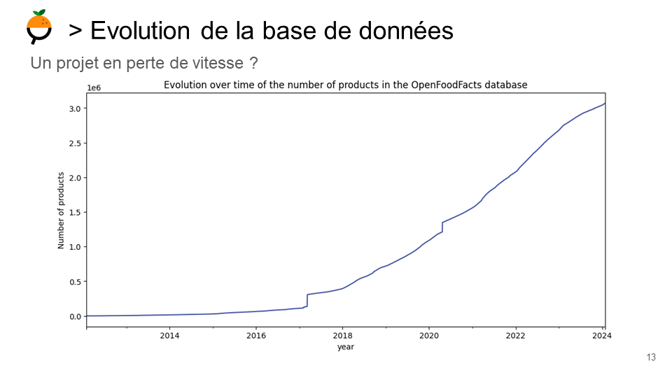

### Une base de données massive, mais creuse
Les dimensions de la base sont impressionnantes: **3.069.472 lignes** (donc produits) et **206 colonnes** à la date de notre étude (février 2024).

Le [dump MongoDB](https://world.openfoodfacts.org/data) pèse **48 Go**, et l'équivalent en CSV **9 Go** !

Mais elle est également creuse:
- 50% des colonnes contiennent moins de 1% d'enregistrements,
- en moyenne, les lignes sont complétées à 20% !

Pour se faire une idée, voici l'affichage de 10.000 lignes avec l'outil `msno` de la bibliothèque `missingno`. Les lignes blanches correspondent à des valeurs manquantes.

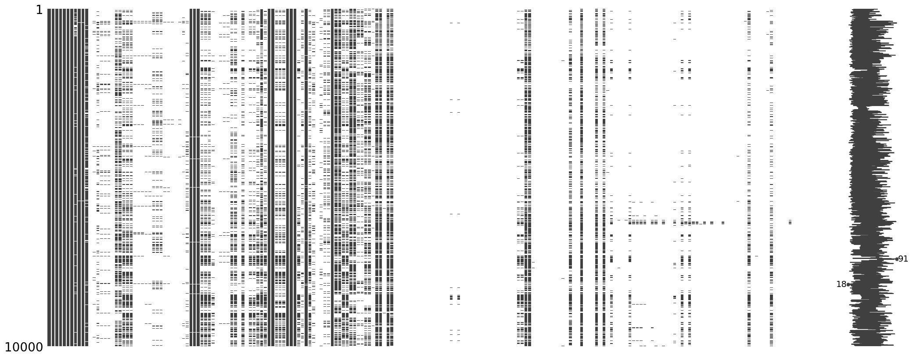

Le taux de complétion par colonne (sur l'ensemble de la base) nous révèle que les colonnes les plus complétées sont celles qui contiennent des informations obligatoires (nom, marque, code-barre, nutriscore, etc.) et les macronutriments (énergie, graisses, glucides, protéines, etc.).

Les colonnes les moins complétées sont celles qui contiennent des informations facultatives ou plus complexes à renseigner (additifs, allergènes, nutriments, etc.).
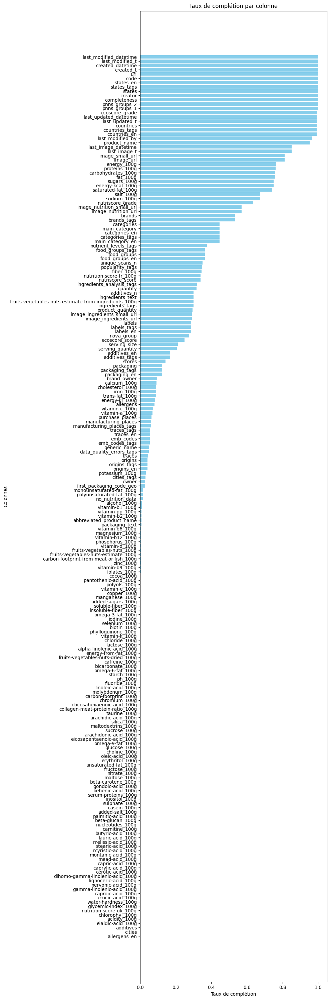

Ce constat est contrariant pour notre projet, car les allergènes ne sont renseignés que pour 8.06% des produits.
Impossible donc de s'appuyer directement sur cette colonne 'allergènes' pour notifier les patients sur le risque de présence d'un allergène.
Mais peut-être que le machine learning pourra nous venir en aide ! 💡

### Une base à optimiser
Outre le nombre de lignes conséquent, et le taux de complétion faible, un autre problème se pose: la structure de la base de données, qui pourrait-être largement optimisée. Des discussions sur cette question existent [au moins depuis 2019](https://github.com/openfoodfacts/openfoodfacts-server/issues/2325), mais les propositions de réorganisation n'ont pas encore été implémentées:
- beaucoup de nutriments ne sont quasiment pas renseignés,
- plusieurs colonnes sont présentes en 3 exemplaires ('x', 'x_tags', 'x_en') avec parfois pour seule différence la présence d'espaces (states vs states_tags),
- certaines lignes sont quasi vides, car il semble que l'utilisateur ait interrompu la saisie,
- les champs 'url' sont lourds (13% du volume de la base).

Un travail de restructuration de la base de données pourrait permettre de réduire le volume de données. Dans le cas d'une utilisation en SQL par exemple, il serait opportun de subdiviser la base en plusieurs tables regroupées autour d'une table d'id.

## 3. Data Engineering: choix d'une structure de donnée pour la mise en production
Le principal défi de notre projet a été la taille de la base de données. Pour l'exploration, nous avons pu mener des analyses sur l'ensemble des données en itérant sur des `chunks` de 10.000 lignes. Charger cette base de données de plus de 3 millions de lignes et 200 colonnes en entier (avec `pandas` par exemple) était impossible sur nos machines.

La question de la structure de données et de la technologie à adopter pour la mise en production d'une application s'appuyant sur cette base s'est vite imposée. Nous avons envisagé deux solutions:

- **SQL**: nous avons envisagé de réimporter la base de données sous forme de tables SQL afin de pouvoir la requêter pendant la phase de développement et pourquoi pas de mise en production de notre application. Nos essais d'import de la base en local grâce à la bibliothèque `sqlalchemy`, et `mariaDB` ont échoué en raison de la taille de la base impossible à charger en entier.
- **MongoDB**: la base de données Open Food Facts étant déjà disponible sous forme de dump MongoDB, cette solution a trouvé notre faveur pour plusieurs raisons:
    - plus adaptée aux données textuelles que SQL,
    - scalabilité et haute disponibilité des bases de données NoSQL,
    - toutefois son modèle de données flexible (pas de schéma prédéfini) n'encourage pas à la structuration des données. La base de données souffrant déjà d'un manque de structuration, nous ne pourrons faire l'économie d'un travail de nettoyage et de restructuration de la base en vue de la rendre plus légère.

## 4. Data Science: Classification d'allergènes

Notre objectif est de concevoir une application permettant de prédire la présence d'allergènes dans un produit alimentaire, simplement en scannant son code-barre.

L'exploration de la base de données nous a permis de constater que les allergènes ne sont renseignés que pour 8.06% des produits. Impossible donc de s'appuyer directement sur cette colonne 'allergènes' pour informer les patients.

Nous avons donc décidé de tenter de classifier les allergènes en utilisant les autres informations disponibles dans la base de données comme les ingrédients par exemple.

Afin de valider notre approche, nous avons choisi de nous concentrer sur un allergène en particulier: le gluten. Nous avons donc construit un jeu de données binaire: 1 si gluten est présent dans la liste des allergènes, 0 sinon.

**Le but de cette partie est donc d'entrainer un modèle de classification capable de prédire la présence de gluten dans un produit alimentaire à partir de sa liste d'ingrédients.**

### 4.1 Préparation des données:
Nous avons travaillé sur un dataset restreint aux données pertinentes pour notre étude:

- sélection des colonnes se restreignant aux ingrédients, catégories d'aliments et allergènes,
- sélection des lignes où la colonne 'allergènes' est renseignée
- création d'une colonne 'gluten_presence' binaire (1 si gluten est présent dans la liste des allergènes, 0 sinon)

Le dataset final contient 27 colonnes, et :
- 106.752 lignes pour la classe 1 (gluten présent)
- 137.276 lignes pour la classe 0 (gluten absent)

On note que les classes sont relativement équilibrées, ce qui a son importance pour la conception du classificateur.

Le principe est le même, quel que soit le modèle de classification utilisé:
- préparation des données textuelles,
- séparation des données en train et test,
- entraînement du modèle,
- évaluation du modèle.

Plusieurs modèles de classification ont été testés: du plus simple (arbre de décision) au plus complexe (réseau de neurones récurrent LSTM).

### 4.2 Arbre de décision
#### Préparation des données textuelles
Les modèles d'arbre de décision ne pouvant pas traiter directement des données textuelles, il est nécessaire de transformer les données textuelles en données numériques via des techniques de NLP.

Grâce à la bibliothèque `nltk` de Python, nous avons nettoyé les données textuelles, puis tokenisé et vectorisé.

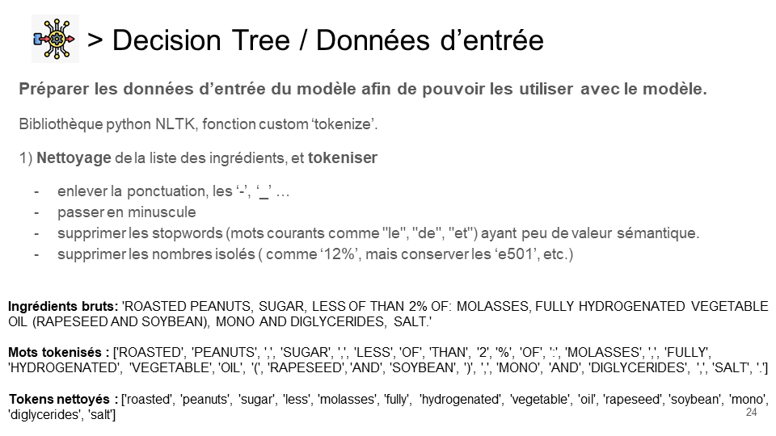

Nous avons également joué sur la longueur des n grammes (longueur des séquences de mots) dans le but de chercher à capturer les séquences de mots. Le modèle ne devrait pas seulement réagir à la présence d'un mot clé, mais aussi à la séquence des mots en entrée. En effet, "sans gluten" ou "gluten free" ont un sens diamétralement opposé.

Les tokens ont enfin été vectorisés (count vectorizer de `sklearn`) pour être utilisés comme données d'entrée du modèle.
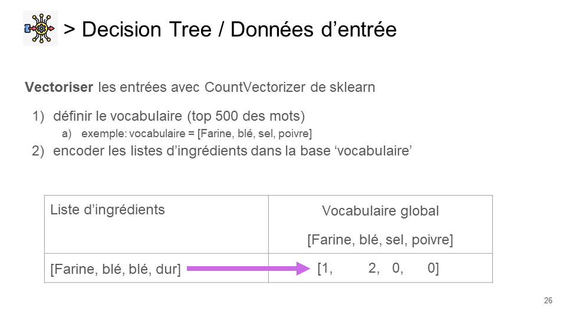

Après recherche des meilleurs hyperparamètres avec `GridSearchCV`, le modèle d'arbre de décision a fourni des résultats satisfaisants, avec un score f1 de 0.87, et surtout un recall de 0.92 sur la classe 0 (absence de gluten).

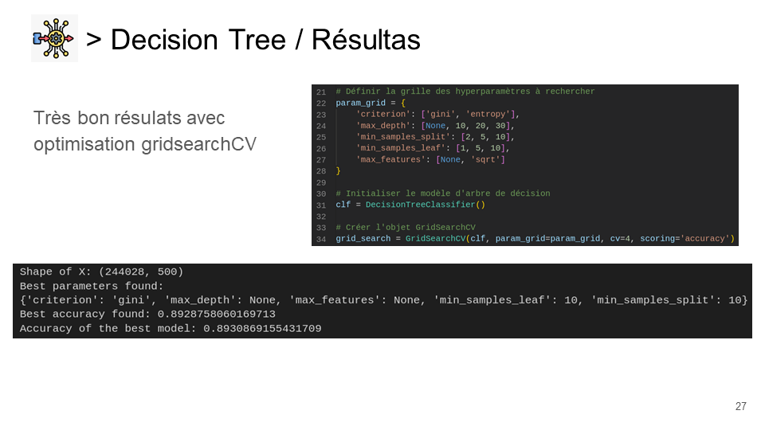
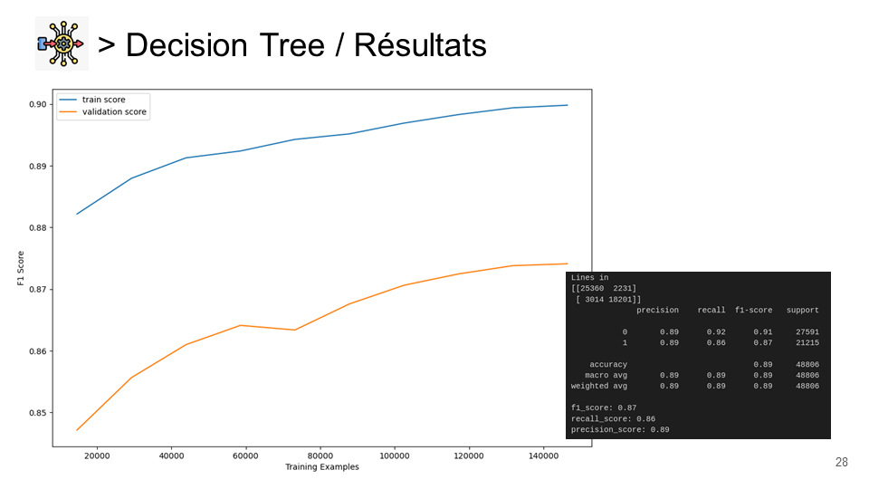

### 4.3 Perceptron multicouche (MLP classifier)
En suivant la même méthodologie que pour l'arbre de décision, le perceptron multicouche (MLP classifier) a lui aussi fourni des résultats satisfaisants, avec un score f1 de 0.87, et un recall de 0.91 sur la classe 0.

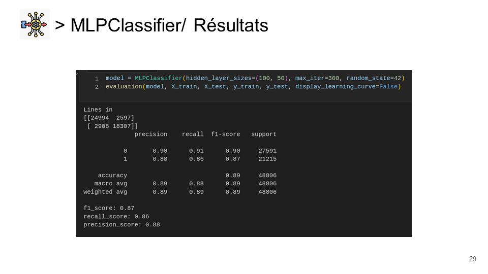

Les mêmes conclusions s'appliquent à l'arbre de décision et au perceptron multicouches:
- les résultats sont satisfaisants, même s'ils doivent être améliorés pour être mis en production, car le risque de faux négatifs est encore trop élevé, ce qui peut s'avérer dangereux pour les personnes allergiques.
- les modèles ne gèrent pas les séquences de mots en entrée, ce qui peut poser problème pour la classification de certains produits (ex: "sans gluten" ou "gluten free"). Nous avons cherché à contourner ce problème en concaténant en un seul token des bigrammes comme 'gluten free', 'sans gluten', 'ohne gluten' en 'glutenfree', 'sansgluten', 'ohnegluten'.

Mais cette solution relevant du bricolage, nous avons cherché à améliorer les résultats en utilisant un modèle dont l'architecture est spécifiquement conçue pour traiter des séquences de mots: le réseau de neurones récurrent LSTM.

### 4.4 Classification avec réseaux de neurones récurrents LSTM

Les LSTM (Long Short Term Memory) sont des réseaux de neurones récurrents qui ont la particularité de conserver en mémoire les informations passées, ce qui les rend particulièrement adaptés pour traiter des séquences de mots.

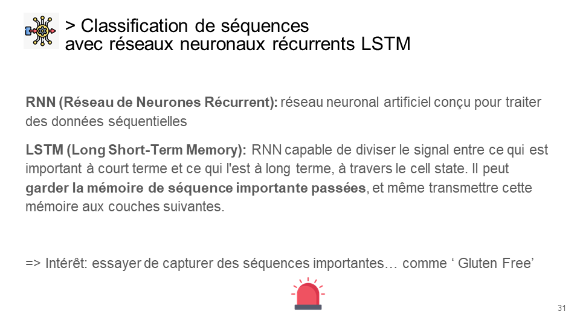
Ces réseaux ne nécessitent pas de vectorisation des données textuelles, les données textuelles sont directement utilisées comme entrée du modèle et gérées par un préprocesseur.

Nous sommes donc partis d'une architecture simple, avec une couche d'embedding, deux ou trois couches LSTM alternant des couches de dropout, et une couche dense de sortie. Nous avons également testé l'utilisation de couches bidirectionnelles, en espérant améliorer les résultats.

Nous avons étudié les résultats de ce type de modèle en fonction de plusieurs paramètres:
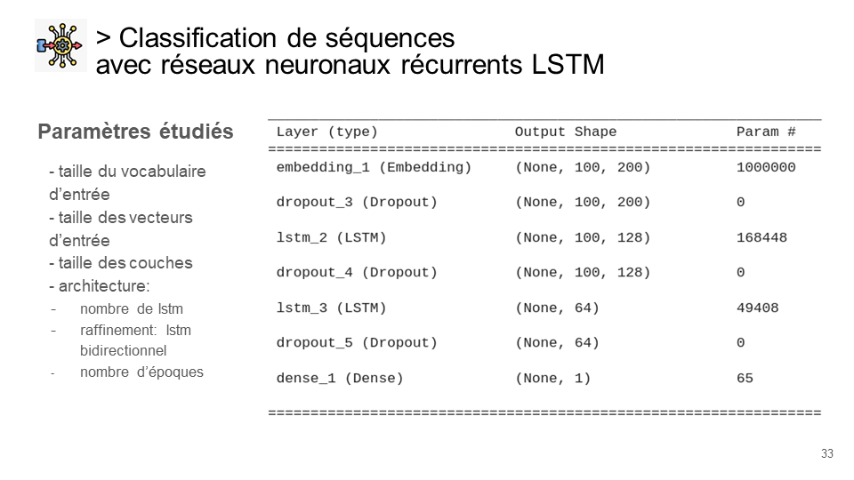
Nous avons tracé les courbes d’entraînement et de validation afin d'évaluer les capacités de généralisation du modèle à des données qu'il n'a jamais vu, ainsi que pour détecter un éventuel surapprentissage (overfitting) ou sous-apprentissage (underfitting).

Scores f1 et accuracy ont été surveillés de près, pour éviter de spécialiser le modèle sur une classe au détriment des autres métriques.

Sur cet exemple, l'accuracy de la courbe d’entraînement augmente légèrement avec le nombre d'époques, tandis que celle de la courbe de validation diminue légèrement. Mais cette diminution étant très faible, on peut considérer que le modèle ne surapprend pas (pas d'overfitting).

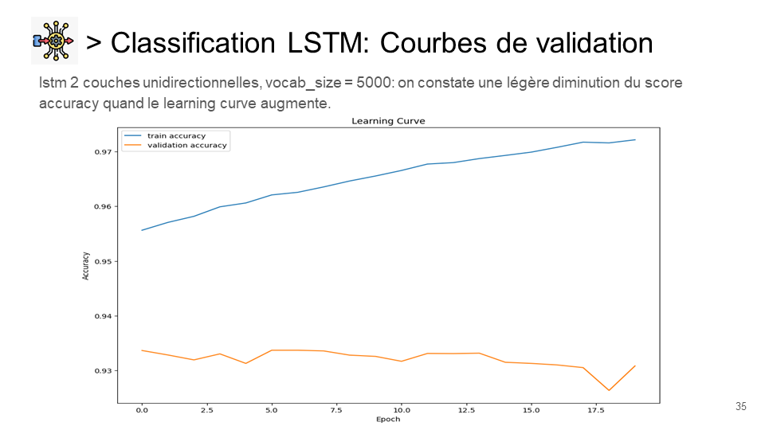

Voici une synthèse des résultats sur le recall de la classe 0 (absence de gluten), pour différentes architectures de modèles, tailles de vocabulaire et nombre d'époques:
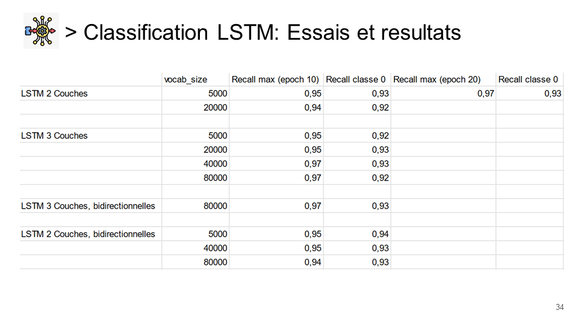

Nous retenons de ces essais que:
- le modèle LSTM fournit des résultats très satisfaisants, avec un recall allant jusqu'à 0.94 sur la classe 0 (absence de gluten). 
- les résultats sont proches, quel que soit la taille du vocabulaire, l'architecture ou le nombre d'époques. 
- cependant **le modèle bidirectionnel** fournit des résultats légèrement meilleurs sur un vocabulaire de base minimal (5000 mots). **C'est ce modèle qui a donc notre préférence**.

# Proof of concept validé !
Nous avons donc validé notre proof of concept: il est possible de classifier les allergènes en utilisant les données textuelles de la base de données Open Food Facts. Le modèle LSTM a fourni des résultats très satisfaisants, avec un recall de 0.94 sur la classe 0 (absence de gluten).

Voici une illustration de l'application en action, avec en entrée une liste d'ingrédients dans une langue que nous ne comprenons pas:

Il reste à présent à passer ce modèle en production, en l'intégrant dans une application mobile qui permettra de scanner un code-barre et d'obtenir une alerte sur le risque de présence d'un allergène.

# Remerciements
Merci à Esther Freyder, [diététicienne nutritionniste à Ingwiller](https://dietetique.freyder.fr/), pour son temps et son expertise métier.

*Sources des images : [flaticon.com](https://www.flaticon.com/), openfoodfacts.org.*

